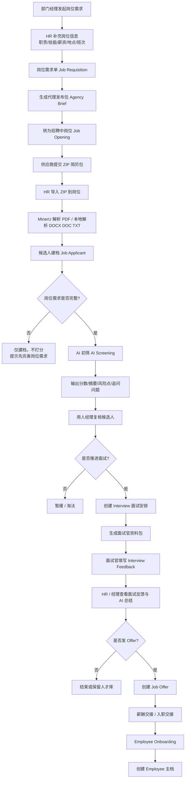

# AIHR 角色权限与流程评估

## 结论摘要

当前 AIHR 已经把招聘主链路的对象和页面做出来了，但还处在：

- 入口分层已完成
- 流程对象已贯通
- AI 能力已接入
- 权限制度化已开始落地，但仍未完全闭环

最关键的现实判断是：

1. `HR / 面试官 / 用人经理` 的页面入口已经分成 3 个中心，且 **Workspace 已按角色绑定**，不再是公开入口。
2. 当前系统 **仍然没有启用 Workflow**，所以岗位审批、Offer 审批、录用确认还不是制度化审批流。
3. `用人经理` 角色已经正式落地为 `AIHR Hiring Manager`，但还缺少“仅看本人部门/本人岗位”的行级限制。
4. 当前最值得优先补的是：`审批流启用 + 部门/岗位范围控制 + 导入结果页`。

---

## 1. 角色与权限梳理

### 1.1 建议的业务角色

当前 AIHR 实际上围绕 5 类角色在工作：

| 角色 | 业务职责 | 当前系统状态 | 建议目标 |
|---|---|---|---|
| 系统管理员 | 环境、用户、参数、权限、异常处理 | 已存在 | 保留 `System Manager` |
| HR 执行 / 招聘专员 | 岗位维护、简历导入、AI 初筛、推进流程 | 已存在 | 对应 `HR User` |
| HR 负责人 | 统筹招聘、录用、入职、员工建档 | 已存在 | 对应 `HR Manager` |
| 用人经理 / 部门经理 | 提岗位需求、复核 AI 摘要、面试决策、Offer 决策 | 已落地为系统角色 | 补部门/岗位范围控制 |
| 面试官 | 查看资料包、填写反馈、参与复核 | 部分存在 | 使用 `Interviewer` 并收口权限 |

### 1.2 当前实际权限落实情况

以下核查基于当前站点 `DocPerm` 与项目代码：

#### 已落实

- `AIHR` 三个工作台
  - 已绑定角色可见范围，不再是公开 Workspace
- `AIHR Hiring Manager`
  - 已创建正式系统角色
  - 已设置 Desk Access
  - 已配置默认首页为 `AIHR Manager Review`
- `Job Requisition`
  - 已通过 `Custom DocPerm` 补齐：
    - `HR User`：读写创建报表
    - `HR Manager`：读写创建删除报表
    - `AIHR Hiring Manager`：读写创建报表
- `Job Opening / Job Applicant / AI Screening / Interview / Interview Feedback / Job Offer`
  - 已向 `AIHR Hiring Manager` 补充相应只读或协同权限

- `AI Screening`
  - `HR User`：可读写创建删除
  - `HR Manager`：可读写创建删除
- `Interview`
  - `System Manager / HR Manager / HR User / Interviewer`：可读写创建提交
- `Interview Feedback`
  - `Interviewer`：可读写创建提交
  - `HR Manager / HR User`：只读
- `Job Offer`
  - `HR User`：可读写创建提交
- `Employee Onboarding`
  - `System Manager / HR Manager`：可读写创建提交
- `Employee`
  - `HR User / HR Manager`：可读写创建
  - `Employee / Employee Self Service`：查看本人相关信息

#### 未落实或落实不完整

- `Job Requisition`
  - 已能由经理发起，但还没有审批 Workflow
- `Job Opening / Job Applicant / AI Screening`
  - 经理已有访问权限，但仍缺“仅看本人部门/本人岗位”的限制
- `AIHR` 三个工作台
  - 已做角色可见绑定，但还没加基于部门的内容过滤

### 1.3 当前权限设计的核心问题

#### 问题 1：经理中心已经有入口，但经理角色没有真正落地

当前存在：

- `AIHR 用人经理中心`
- 自定义 `AIHR Hiring Manager` 角色

但系统里还没有：

- 基于部门/岗位的行级权限
- 经理仅看自己岗位的过滤策略

结果是：

- 页面存在
- 权限不闭环
- 真实上线时很容易变成“大家都看同一堆数据”

#### 问题 2：岗位需求入口和业务实际不一致

业务真实目标是：

`部门经理提需求 -> HR 补充 -> 审核 -> 转招聘中岗位`

当前已补齐：

- `AIHR Hiring Manager` 可创建/编辑 `Job Requisition`
- `HR User / HR Manager` 仍可协同维护

仍然缺的是：

- “经理提交 -> HR补充 -> 审批 -> 开启岗位”的正式 Workflow

#### 问题 3：工作流还没有启用

当前站点核查结果：

- `Job Requisition`：无 Workflow
- `Job Opening`：无 Workflow
- `Job Applicant`：无 Workflow
- `Interview`：无 Workflow
- `Interview Feedback`：无 Workflow
- `Job Offer`：无 Workflow
- `Employee Onboarding`：无 Workflow

这意味着现在是：

- 有状态
- 有按钮
- 有自动化
- 但没有审批流

### 1.4 建议的权限目标矩阵

建议按下面的最终矩阵收口：

| 对象 | HR User | HR Manager | AIHR Hiring Manager | Interviewer | System Manager |
|---|---|---|---|---|---|
| Job Requisition | 读写 | 审批/读写 | 创建/查看本人部门 | 仅无 | 全量 |
| Job Opening | 读写 | 审批/读写 | 查看本人岗位 | 仅无 | 全量 |
| Job Applicant | 读写 | 读写 | 查看本人岗位候选人 | 仅读面试相关候选人 | 全量 |
| AI Screening | 读写 | 读写 | 只读本人岗位 | 仅摘要只读 | 全量 |
| Interview | 读写 | 读写 | 只读本人岗位 | 读写本人面试 | 全量 |
| Interview Feedback | 只读/协同 | 只读/决策 | 只读/决策 | 创建/提交本人反馈 | 全量 |
| Job Offer | 创建/推进 | 审批 | 只读/确认 | 无 | 全量 |
| Employee Onboarding | 推进 | 审批 | 只读 | 无 | 全量 |
| Employee | 维护 | 维护 | 无 | 无 | 全量 |

### 1.5 后续权限落地计划

#### P0

- 已完成：新增角色 `AIHR Hiring Manager`
- 已完成：给 3 个 AIHR Workspace 显式绑定角色
- 已完成：修正 `Job Requisition` 的创建权限，让经理可发起
- 待完成：让经理中心默认只能看“我负责/我部门”的岗位和候选人

#### P1

- 建 `Workflow`
  - 岗位需求审批流
  - Offer 审批流
  - 入职交接确认流
- 增加 `User Permission`
  - 按 `Department`
  - 按 `Job Opening`
  - 按 `Interviewer`

#### P2

- 行级权限
  - 经理只能看自己部门
  - 面试官只能看分配到自己的面试
- 审计日志视图
  - 谁改了状态
  - 谁触发了 AI
  - 谁完成了审批

---

## 2. 端到端操作流程图

### 2.1 当前实际已打通到哪里

当前已经能跑通：

- `岗位需求`
- `招聘中岗位`
- `ZIP 简历包导入`
- `MinerU / 本地解析`
- `候选人建档`
- `AI 初筛`
- `经理复核入口`
- `面试协同`
- `面试反馈`
- `Offer`
- `入职交接`
- `Employee 主档创建`

### 2.2 当前仍不够“制度化”的环节

- 岗位需求审批
- Offer 审批
- 经理角色隔离
- 导入结果页可视化
- 供应商质量评估
- 通知与催办机制

---

## 3. 缺少或应优化的关键点

下面按优先级梳理。

### P0 必补

#### 1. 用人经理角色正式落地

当前最大缺口不是页面，而是权限。

应补：

- `AIHR Hiring Manager` 角色
- 经理中心按角色可见
- 经理只能看本人部门/本人岗位

#### 2. 岗位需求审批流

目前岗位需求是记录，不是审批流。

应补：

- `Draft -> Submitted -> HR Enriched -> Manager Confirmed -> Approved -> Opened`
- 经理确认与 HR 补充动作分开

#### 3. ZIP 导入结果页

现在导入能跑，但结果还主要在弹窗和日志里。

应补一个正式结果页，展示：

- 导入批次
- 成功数量
- 失败数量
- 不支持文件
- 使用的解析引擎
- 候选人建档结果
- AI 初筛状态
- 待经理复核名单

#### 4. AI 评分可解释性

现在系统已有：

- 分数
- 摘要
- 风险点

还应补：

- 评分来源：`ai_semantic / heuristic`
- 解析来源：`MinerU API / Local PDF / DOCX`
- 岗位要求版本号
- 是否缺岗位需求

### P1 很值得做

#### 5. 供应商质量评估

这是比“内部排行榜”更适合做的能力。

建议做：

- 每家供应商导入数量
- 可解析率
- 进入经理复核率
- 面试通过率
- Offer 转化率

#### 6. 行级过滤和责任人机制

当前已经有不少 `owner / next_action / follow_up_owner` 字段，但还没真正用来做过滤。

建议落地：

- 我的岗位
- 我的候选人
- 我的面试
- 我的待办

#### 7. 通知与催办

当前仍偏手工。

建议补：

- 经理待复核提醒
- 面试官待反馈提醒
- Offer 待审批提醒
- 入职待交接提醒

### P2 后续增强

#### 8. 面试助手进一步升级

当前已具备：

- AI 面试资料包
- AI 面试反馈总结

后续可补：

- 基于岗位生成结构化面试题纲
- 面试反馈标准化评分模板
- 多轮面试汇总页

#### 9. JD 与评分配置中心

让 HR 能配置：

- 技能词权重
- 城市权重
- 年限权重
- 模型模板
- 岗位模板

#### 10. 候选人去重与人才库

真实场景中同一候选人会被多个供应商重复投递。

建议补：

- 手机/邮箱/姓名模糊去重
- 合并候选人记录
- 历史投递轨迹

---

## 4. 最建议的后续执行顺序

1. 先补权限，不要先堆更多页面
2. 先补岗位需求审批流，再补 Offer 审批流
3. 先补 ZIP 导入结果页，再做供应商质量看板
4. 经理视角先做“只看我相关”，再谈更复杂的数据权限

## 5. 当前项目判断

如果按“招聘优先 MVP”来判断，AIHR 当前已经具备：

- 可演示
- 可试用
- 可联调真实中文 PDF 简历
- 可跑真实 MinerU
- 可跑真实大模型语义筛选

但如果按“可正式给多角色上线”判断，当前最大的短板仍然是：

- 权限模型
- 审批工作流
- 导入结果页
- 供应商质量与过程透明度

所以，下一阶段不该把重点放在“再多做几个页面”，而应该放在：

**把角色、权限、审批和结果透明度做实。**
